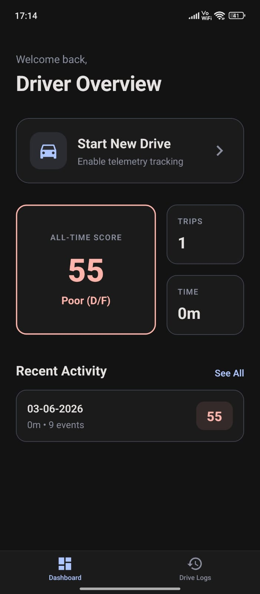
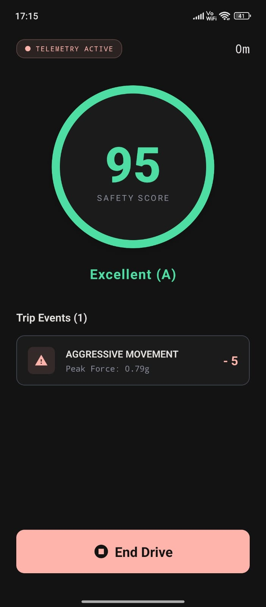
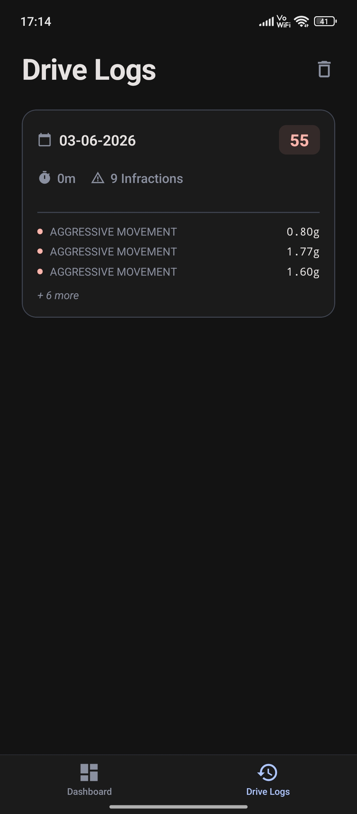

# SafeDrive

## Project Overview
SafeDrive is a React Native mobile application built with Expo that tracks and analyzes real-time driving telemetry. By leveraging built-in device sensors, the app monitors driving behavior to detect harsh events like sudden braking, aggressive steering, and phone handling. It aims to promote safer driving habits by providing users with a real-time driving score that dynamically updates based on their on-road performance.

## Demo Video
📺 **[Watch the SafeDrive Demo on YouTube](https://youtube.com/shorts/liPtIOwqVIY?si=OLjVZucN53Y04MtT)**

## Screenshots
*(Note: Images are referenced from the local assets folder)*

<div align="center">
  
  
  
</div>

## Tech Stack Used
* **Framework:** React Native (v0.83.6), Expo (v55)
* **Language:** TypeScript
* **State Management:** Zustand
* **Routing:** Expo Router (File-based routing)
* **Hardware APIs:** `expo-sensors`, `expo-keep-awake`

## Sensors Used
SafeDrive taps into multiple device sensors via `expo-sensors` to build a comprehensive picture of vehicle movement:
* **Accelerometer:** Measures raw acceleration forces.
* **Gyroscope:** Measures the rate of rotation around the device's X, Y, and Z axes.
* **Magnetometer:** Acts as a compass to calculate the vehicle's heading and detect sharp heading changes.
* **DeviceMotion:** Provides processed linear acceleration (with gravity factored out) for more accurate movement tracking.

## Event Detection Strategy
The app uses a window-based continuous polling strategy to detect anomalies in driving behavior:
1. **Data Ingestion:** Sensors poll data at a fixed interval of **80ms**.
2. **Signal Processing:** A low-pass filter (Alpha: 0.8) is applied to raw sensor data to reduce noise.
3. **Buffering:** Sensor frames are stored in a circular buffer of size 10.
4. **Window Analysis:** Once the buffer is full, the `EventDetector` analyzes the rolling window. It requires specific thresholds to be breached for a consecutive number of "ticks" (frames) to confirm an event, preventing false positives from sudden, split-second jolts.
5. **Cooldown Mechanism:** A strict **3-second (3000ms) cooldown** is enforced after any detected event to prevent duplicate penalty triggers for the same physical movement.

## Threshold Values Chosen
To balance sensitivity and accuracy, the following thresholds are used:

| Metric | Threshold Value | Detection Logic |
| :--- | :--- | :--- |
| **Harsh Braking** | `< -0.25 G` (Accel Y) | Must persist for $\ge$ 3 ticks |
| **Harsh Acceleration** | `> 0.25 G` (Accel Y) | Must persist for $\ge$ 3 ticks |
| **Sharp Turn** | `> 0.5 Rad/s` (Gyro Z) | Must persist for $\ge$ 3 ticks, OR a Heading change > 20° |
| **Aggressive Steering** | `> 0.8 Rad/s` | Based on max/min Z-rotation variance in the window |
| **Excessive Movement** | `> 0.5 G` (Magnitude) | Must persist for $\ge$ 2 ticks |
| **Phone Handling** | `> 1.0 Rad/s` (Gyro X/Y) | Must persist for $\ge$ 2 ticks |

## Driving Score Calculation Logic
Every drive starts with a perfect score of **100**. As unsafe events are detected, penalties are immediately deducted from the score. The score is hard-capped at a minimum of 0.

**Penalty Deductions:**
* 📱 **Phone Handling:** -10 points *(Heaviest penalty, as distracted driving is highly dangerous)*
* 🛑 **Harsh Braking:** -5 points
* 🚀 **Harsh Acceleration:** -5 points
* 🔄 **Aggressive Steering:** -4 points
* ↪️ **Sharp Turn:** -3 points
* 📳 **Excessive Movement:** -3 points

## Assumptions Made
1. **Device Orientation:** The current accelerometer logic (e.g., relying heavily on `accel.y` for braking/acceleration) assumes the phone is placed in a relatively stable, upright, and forward-facing position (like a dashboard mount). If the phone is loose in a cup holder or pocket, the relative axes will shift, potentially skewing directional event detection.
2. **Sensor Availability:** It is assumed the host device has a functioning Magnetometer, Gyroscope, and Accelerometer. 
3. **GPS-Independence:** Speed and acceleration are calculated purely via IMU (Inertial Measurement Unit) sensors rather than GPS location changes to save battery and provide higher frequency data.

## How to Run Locally

### Prerequisites
* Node.js installed
* Expo Go app installed on your physical iOS or Android device (Emulators lack physical movement sensors).

### Setup Steps
1. Clone the repository and navigate to the project folder.
2. Install dependencies:
   ```bash
   npm install